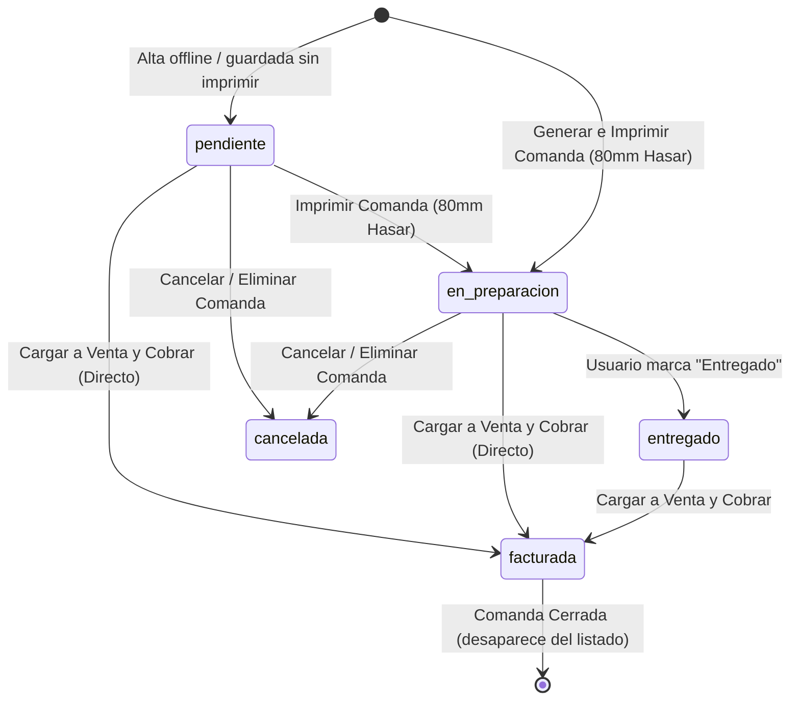

# Módulo de Comandas (80mm Hasar) — Estado Final Implementado

Módulo **independiente** de **Comandas** integrado en Ventas. El sistema de **Tickets Pendientes** permanece **intacto** (tabla, modelo y modal sin modificar).

> Última actualización: sesión de depuración + build Tauri AppImage verificado funcionando.

---

## 🔄 Ciclo de Vida de Estados (flujo real en la app)

Como al presionar **"Generar Comanda"** se abre inmediatamente el diálogo de impresión y la comanda se envía a la comandera, el primer estado activo **siempre es `en_preparacion`** (el estado `pendiente` queda reservado para comandas guardadas sin imprimir, p. ej. offline o reimpresión posterior).

| Estado | Descripción | Disparador / Acción |
| :--- | :--- | :--- |
| **`pendiente`** | Comanda guardada pero aún no enviada a cocina (caso offline o sin impresión). | Alta sin impresión. |
| **`en_preparacion`** | Comanda impresa en comandera (cocina/barra en proceso). **Estado inicial habitual.** | *"Generar Comanda (80mm)"* o *"Imprimir"* desde el modal. |
| **`entregado`** | Pedido entregado a mesa/cliente. | Botón *"Marcar como Entregado"* en el modal. |
| **`facturada`** | Comanda cobrada vía Ventas. Desaparece del listado activo (`getComandas` excluye `facturada`/`cancelada`). | Al completar la venta ("Cobrar") con la comanda cargada → `PUT /comandas/:id/status {facturada}`. |
| **`cancelada`** | Comanda anulada. | Botón *"Eliminar / Anular"* → `DELETE /comandas/:id`. |

---

## 🛠️ Detalle Técnico de la Implementación (estado final)

---

### 1. Backend (Node.js / Express / Sequelize)

#### [NEW] [ComandaModel.js](file:///home/hugo/01-Proyectos/001-POS-System/back/Models/ComandaModel.js)
- Tabla `comandas`:
  - `id` (PK, INTEGER AUTO_INCREMENT)
  - `name` (STRING NOT NULL, ej: *"Mesa 4"*, *"Pedido #12"*)
  - `status` (ENUM: `'pendiente'`, `'en_preparacion'`, `'entregado'`, `'facturada'`, `'cancelada'`), por defecto `'pendiente'`.
  - `comanda_data` (JSON: ítems, notas de preparación por ítem, cliente, `user_name`, `createdAt`)
  - `user_id` (INTEGER, nullable, FK → `usuarios.id`)
  - `cash_session_id` (**BIGINT**, nullable, FK → `cash_sessions.id` — BIGINT porque `cash_sessions.id` es BIGINT; con INTEGER MySQL rechaza la FK: `comandas_ibfk_2 are incompatible`)
  - `createdAt`, `updatedAt`
- Auto-sync `ComandaModel.sync({ force: false })` con `catch` que solo loguea (no rompe el arranque).

#### [MODIFY] [associations.js](file:///home/hugo/01-Proyectos/001-POS-System/back/database/associations.js)
- Asociaciones con **alias explícito** (clave para que el `include` devuelva siempre `usuario`):
  - `ComandaModel.belongsTo(UsuarioModel, { foreignKey: 'user_id', as: 'usuario' })`
  - `UsuarioModel.hasMany(ComandaModel, { foreignKey: 'user_id', as: 'comandas', ... })`
  - `ComandaModel.belongsTo(CashSessionsModel, { foreignKey: 'cash_session_id', as: 'cash_session' })`
  - `CashSessionsModel.hasMany(ComandaModel, { foreignKey: 'cash_session_id', as: 'comandas' })`

#### [NEW] [comandaController.js](file:///home/hugo/01-Proyectos/001-POS-System/back/controllers/comandaController.js)
- `getComandas`: activas (excluye `facturada`/`cancelada`), filtro opcional `cash_session_id` (solo enteros > 0), `include: [{ model: UsuarioModel, as: 'usuario', ... }]`, orden `createdAt DESC`.
- `createComanda`: valida `name` no vacío; normaliza `user_id` (`user_id ?? req.usuario?.id ?? req.user?.id`, solo enteros > 0 sino `null`); normaliza `cash_session_id` (UUIDs de sesión offline → `null` para no romper la FK BIGINT); parsea `comanda_data` si llega como string y garantiza `name`/`createdAt` dentro; responde con la comanda + `usuario`.
- `updateComandaStatus`: valida ENUM, guarda y responde con la comanda recargada + `usuario`.
- `updateComanda` y `deleteComanda`: análogos (update recarga con `usuario`).

#### [MODIFY] [routes.js](file:///home/hugo/01-Proyectos/001-POS-System/back/routes/routes.js)
- `GET /comandas`, `POST /comandas`, `PUT /comandas/:id/status`, `PUT /comandas/:id`, `DELETE /comandas/:id` (todas con `checkPermission('accion_crear_venta')`).

---

### 2. Base de Datos Local / Offline (Dexie)

#### [MODIFY] [offlineDB.js](file:///home/hugo/01-Proyectos/001-POS-System/front/src/db/offlineDB.js)
- Tabla `comandas: '++local_id, server_id, status, sync_status'`.
- Funciones: `getVisibleComandas` (excluye `sync_status='deleted'` **y** `status facturada/cancelada`, igual que el backend), `addLocalComanda`, `updateLocalComandaStatus`, `closeLocalComanda`.
- **[FIX] `syncServerComandasToLocal(serverComandas)`** (nueva, equivalente a `syncServerTicketsToLocal`): sincroniza servidor→Dexie preservando cambios locales (`created`/`updated`/`deleted`), refresca `data` de las `synced` y purga locales `synced` que ya no están en el servidor (p. ej. comandas facturadas que el servidor ya no devuelve). Permite que la UI lea **siempre forma Dexie única** `{ local_id, server_id, status, data, sync_status }`.

#### [MODIFY] [useQuery.js](file:///home/hugo/01-Proyectos/001-POS-System/front/src/hooks/useQuery.js) + [syncService.js](file:///home/hugo/01-Proyectos/001-POS-System/front/src/services/syncService.js)
- **[FIX] `/comandas` unificado como `/pending-tickets`**: online hace `GET /comandas` → `syncServerComandasToLocal()` → retorna `getVisibleComandas()`. Antes devolvía `res.data` directo (forma servidor) y offline devolvía Dexie → doble forma que rompía parse y acciones.
- **[FIX] `syncService` acepta ambas formas**: helpers `getComandaServerId()` (`server_id ?? data?.id ?? raw?.id ?? id`) y `getComandaLocalId()` (por `local_id` o búsqueda por `server_id`).
  - `saveComanda`: sanitiza payload (nombre trim, ids numéricos o `null`), online guarda/actualiza copia local `synced` sin duplicar por `server_id`; offline guarda `created`.
  - `updateComandaStatus`: online hace `PUT` aunque el objeto no traiga `local_id`; `facturada`/`cancelada` offline cierran el local (no quedan visibles).
  - `deleteComanda`: borra en servidor + local por `server_id` aunque no haya `local_id`.
  - Nuevos `syncPendingComandas()` (cola `created`/`updated`/`deleted`) y `syncAllComandas()` (sync-down completo).

---

### 3. Impresión Térmica Hasar (80mm)

#### [MODIFY] [printUtils.jsx](file:///home/hugo/01-Proyectos/001-POS-System/front/src/functions/printUtils.jsx)
- Función `printComanda(comandaData)`:
  - Formato para papel de 80mm (~72mm de impresión real).
  - Encabezado: **COMANDA #ID - MESA / NOMBRE**, Fecha/Hora, Mozo/Cajero.
  - Tipografía grande y negrita para cantidades e ítems.
  - Resaltado de **Notas de Preparación** por producto (*ej: "Sin cebolla"*, *"Bien cocido"*).
  - **Sin precios ni importes** (diseño enfocado exclusivamente en cocina/barra).

---

### 4. Componentes Frontend (React / Material-UI)

#### [NEW] [ComandasModal.jsx](file:///home/hugo/01-Proyectos/001-POS-System/front/src/styledComponents/ComandasModal.jsx)
- Modal para gestión de Comandas Activas:
  - Tarjetas/Tabla mostrando Nombre, Hora, Ítems y **Chip de Estado** (`Pendiente` [Amarillo], `En Preparación` [Azul], `Entregado` [Verde]).
  - Botón para cambiar estado rápidamente de *En Preparación* -> *Entregado*.
  - Botón **"Cargar a Venta"** para llevar la comanda al carrito y procesar el cobro.
  - Botón **"Imprimir Comanda"** (actualiza el estado a `en_preparacion` al disparar la impresión de 80mm).
  - Botón **"Cancelar Comanda"**.

#### [NEW] [ComandaItemNoteModal.jsx](file:///home/hugo/01-Proyectos/001-POS-System/front/src/styledComponents/ComandaItemNoteModal.jsx)
- Diálogo para añadir/editar observaciones de cocina a cada producto del carrito.

#### [NEW] Agregar ítems a comanda existente
- Mientras la comanda no esté facturada se le pueden sumar productos: con ítems en el carrito, abrir **Comandas Activas** y presionar el botón ➕ (*PlaylistAdd*, naranja) en la fila correspondiente.
- Flujo (`handleAddItemsToComanda` en `Ventas.jsx`): un solo diálogo de confirmación con casilla **"Imprimir agregado en cocina (80mm)" tildada por defecto** → fusiona ítems (`comanda_data.items` existentes + carrito) → `syncService.updateComanda` (`PUT /comandas/:id`, funciona online y offline vía `updateLocalComanda`) → limpia el carrito y refresca.
- **Impresión opcional**: si la casilla está tildada, se imprime **solo lo agregado** con encabezado `*** AGREGADO A COMANDA ***` (`printComanda(data, { addition: true })`) y la comanda pasa a `en_preparacion` (si estaba `entregado`, vuelve a cocina). Si se destilda (p. ej. bebidas que van directo a la mesa, sin cocina), no se imprime nada y la comanda **conserva su estado anterior**.
- El botón se deshabilita si el carrito está vacío.
- La cola offline `syncPendingComandas` en estado `updated` ahora envía el contenido completo (`name`/`status`/`comanda_data`), no solo el estado.

#### [MODIFY] [Ventas.jsx](file:///home/hugo/01-Proyectos/001-POS-System/front/src/components/Ventas.jsx)
- Botones en la barra superior: **"Generar Comanda (80mm)"** y **"Comandas Activas (X)"**.
- Icono por renglón para notas de preparación (`ComandaItemNoteModal`).
- **Alta de Comanda** (`handleCreateAndPrintComanda`): pide nombre (validado no vacío), arma payload con `user_name`/`user_id` seguros (`usuario?.nombre`, solo id > 0) y `cash_session_id` solo si es numérico (UUID offline → `null`); guarda vía `syncService.saveComanda`, imprime con `printComanda`, limpia el carrito y refresca.
- **[FIX] `parseComandaRow` robusto**: soporta forma Dexie y servidor (incluido `data` anidado), todas las variantes de usuario (`usuario`/`usuarios`/`Usuario`/`user` + `comanda_data.user_name`) y todas las variantes de ítems (`items`/`productos`/`tempTable`, `stock?.name`); retorna `{ id, serverId, localId, name, status, items, userName, createdAt }`.
- **[FIX] Cobro de Comanda**: al cobrar con `currentComandaId`, hace `updateComandaStatus(target, 'facturada')` (con fallback a delete) en vez del `DELETE` anterior; la búsqueda contempla `server_id`, `data.id`, `id` y `local_id`; deps del callback incluyen `comandas`/`currentComandaId`/`refetchComandas`.
- Imprimir desde el modal (`handlePrintComandaDirect`) imprime y pone `en_preparacion` vía `syncService` (ahora sí llega a la API).
- **Atajo de teclado `Alt+G`**: genera la comanda igual que el botón (análogo a `Alt+P` de tickets pendientes). No dispara si el modal de comandas o el de notas está abierto, ni dentro del modal de resumen de venta. El botón muestra la etiqueta `Generar Comanda (Alt+G)`.

---

## 🐛 Sesión de Depuración — Problemas Encontrados y Soluciones

Reporte: *"no se guarda el nombre de la comanda, el usuario, etc."* + botones del modal sin efecto.

| # | Problema | Causa raíz | Solución |
|---|----------|------------|----------|
| 1 | Botones de estado/eliminar/cobrar no hacían nada online | `updateComandaStatus`/`deleteComanda` solo leían `comanda.server_id \|\| comanda.data?.id` y `comanda.local_id`; online los objetos eran forma servidor (`{id,...}`) → `serverId=undefined`, no se llamaba a la API | Helpers `getComandaServerId/getComandaLocalId` que aceptan ambas formas |
| 2 | Modal mostraba "Comanda Sin Nombre" / "N/A" | Doble forma online/offline + alias de `include` sin `as` (clave de usuario impredecible) | Forma Dexie única vía `syncServerComandasToLocal` + alias `as: 'usuario'` + `parseComandaRow` con todas las variantes |
| 3 | Error FK `comandas_ibfk_2 are incompatible` al arrancar | `cash_session_id` INTEGER vs `cash_sessions.id` BIGINT | `cash_session_id` → BIGINT en `ComandaModel` |
| 4 | 500 al crear comanda con sesión offline | Se enviaba UUID de sesión local como `cash_session_id` | Sanitización: solo enteros > 0, sino `null` (back y front) |
| 5 | Crash si `usuario` null al crear | `usuario.nombre` directo | `usuario?.nombre ?? 'N/A'`, `user_id` null-safe (FK nullable) |
| 6 | Cobro eliminaba en vez de facturar | Se llamaba a `deleteComanda` | `updateComandaStatus('facturada')` al cobrar |
| 7 | Comandas `facturada` offline seguían visibles | `getVisibleComandas` solo filtraba `deleted` | Filtra también `facturada`/`cancelada`; cerrar offline elimina el local |
| 8 | Copias locales `synced` duplicadas/basura | `saveComanda` online hacía `add` siempre | Upsert por `server_id` + purga en `syncServerComandasToLocal` |

---

## 🧪 Plan de Verificación

1. **Flujo de Estados** (verificado OK en AppImage):
   - Crear Comanda → estado inicial `en_preparacion` (se imprime al crear) ✅
   - Re-imprimir desde el modal → sigue/queda en `en_preparacion` ✅
   - Marcar `entregado` desde el modal ✅
   - Cargar a Venta y "Cobrar" → pasa a `facturada` y desaparece del listado ✅
   - Cancelar/Eliminar → desaparece del listado ✅
   - Nombre, ítems, mozo/cajero y hora visibles en el modal ✅
2. **Independencia de Tickets Pendientes**:
   - Tickets pendientes sin modificar (modelo, tabla y modal intactos) ✅
3. **Builds**:
   - `node -c` backend (model, controller, routes, associations) ✅
   - `pnpm --dir front build` (Vite) ✅
   - `pnpm tauri build` → `POS-System_0.1.0_amd64.AppImage` + `.deb` ✅ (probado por el usuario: "funciona perfecto")
